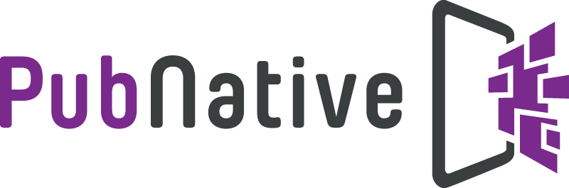

# PubNative iOS Integration Samples

Pubnative SDK is an Open Source advertising solution with remote control using the PubNative Dashboard.

This is a collection of most common PubNative SDK integration examples for iOS. (Swift &amp; Objective-C)

### License

This code is distributed under the terms and conditions of the MIT license.

### Contributing

**NB!** If you fix a bug you discovered or have development ideas, feel free to make a pull request.
